# 树

- 节点（node）：树的元素，包含数据项和若干指向其子树的分支
- 度（degree）：节点拥有子树的数目
- 叶子（leaf）：度为0的节点

## 二叉树

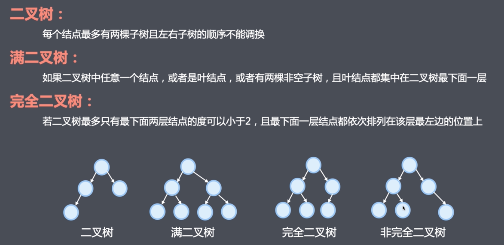

二叉树是n个节点的有限集。它或为空树，或由两颗分别称为左子树和右子树的互不相交的二叉树构成。

- 二叉树每个节点最多有两个子树
- 二叉树的左右子树顺序不能颠倒

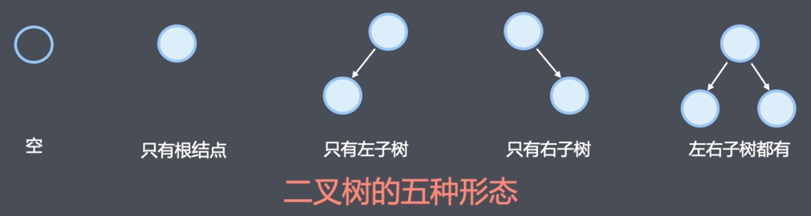

```javascript
function TreeNode(val, left, right) {
    this.val = val;
    this.left = left || null;
    this.right = right || null;
}
```


## 深度优先遍历
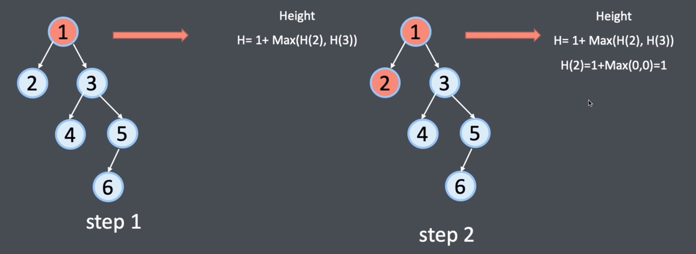
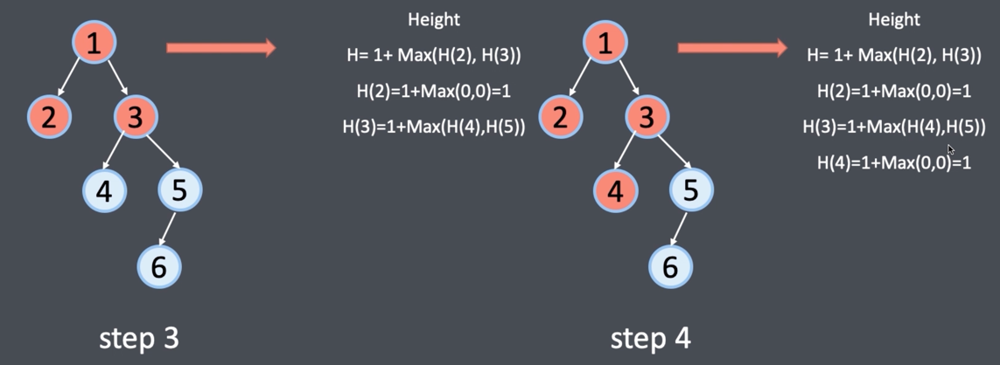
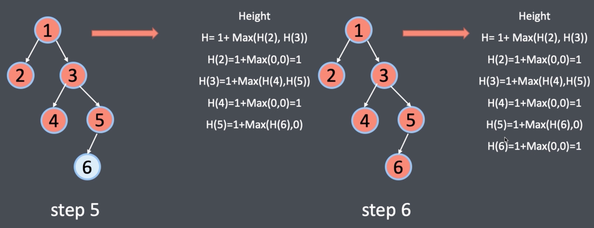
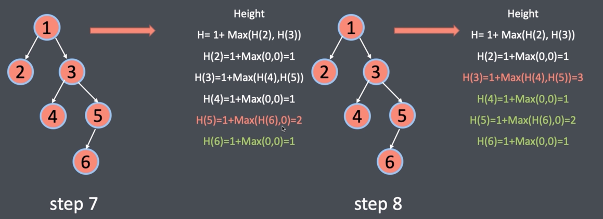
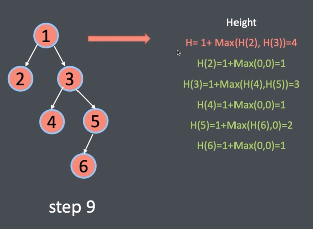

每个节点都需要被遍历一次：时间复杂的O(n)
递归需要栈，栈的深度是树的高度：空间复杂度为O(h)


```javascript
var maxDepthDFS = function (root) {
    if (root == null) return 0
    let left = maxDepthDFS(root.left)
    let right = maxDepthDFS(root.right)
    return 1 + Math.max(left, right)
}
```
## 广度优先遍历

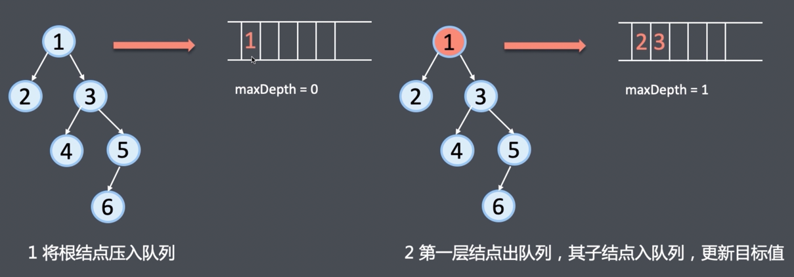
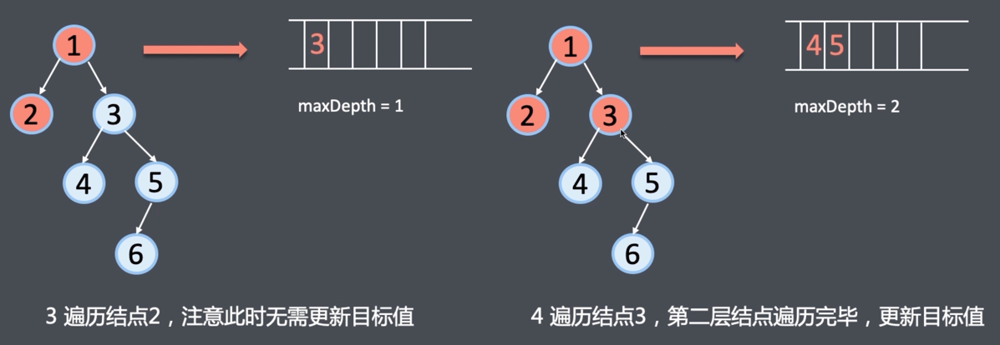
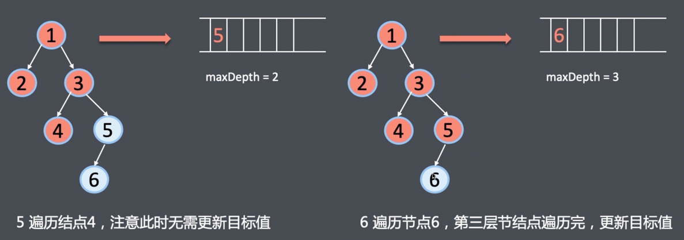 
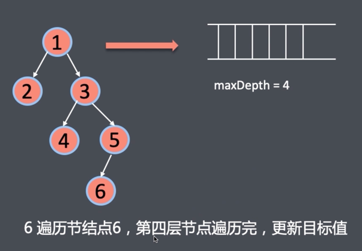

```javascript
function BFS(root){
    if (root == null){
        return 0;
    }
    let depth = 0;  // 目标值
    let queue = [root]; // 广度优先遍历队列
    while(queue.length > 0){
        let size = queue.length
        while (size > 0){
            root = queue.shift();   // 遍历每一个节点
            root.left && queue.push(root.left)
            root.right && queue.push(root.right)
            size--;         // 本节点遍历完成，size - 1
        }
        // 本层遍历完成，depth + 1
        depth++
    }
    return depth
}
```
