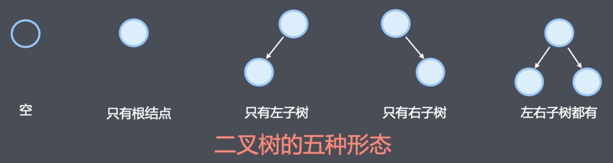
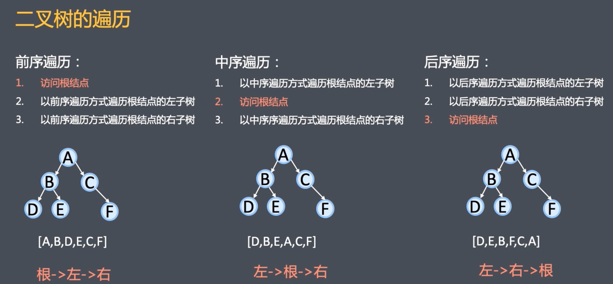
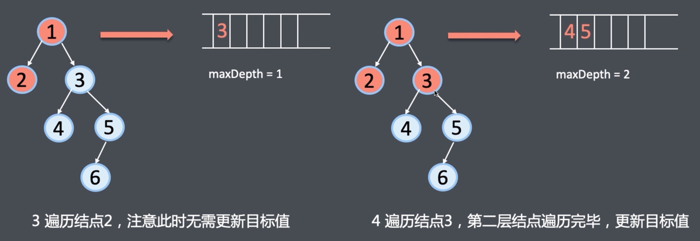
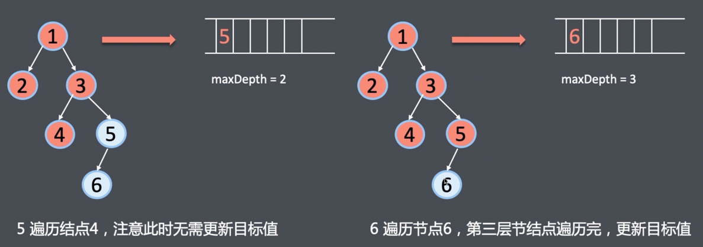
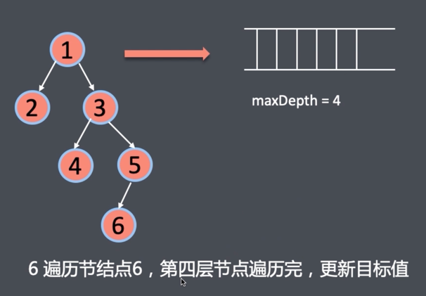

# 树

- 节点（node）：树的元素，包含数据项和若干指向其子树的分支
- 度（degree）：节点拥有子树的数目
- 叶子（leaf）：度为0的节点

## 二叉树

二叉树是n个节点的有限集。它或为空树，或由两颗分别称为左子树和右子树的互不相交的二叉树构成。

- 二叉树每个节点最多有两个子树
- 二叉树的左右子树顺序不能颠倒



```javascript
function TreeNode(val, left, right) {
    this.val = val;
    this.left = left || null;
    this.right = right || null;
}
```


## 深度优先遍历

## 广度优先遍历



 

